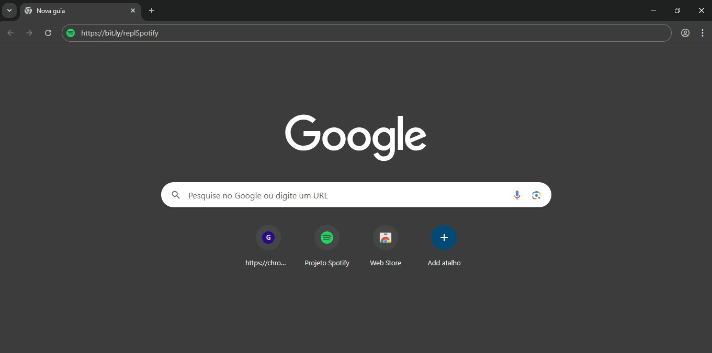

# Réplica do Spotify 

## 🧐 Prévia

Abaixo, uma prévia do projeto finalizado 🤝!

<div align="center">
  
</div>

---

## 🚀 Tecnologias Utilizadas

A seguir, algumas das tecnologias usadas para o desenvolvimento do projeto. A divisão foi feita da seguinte maneira: Tecnologia | Versão (atual ou utilizada).

<div>
  
  
  
  
</div> <br/>

_Obs: durante a produção do réplica foi utilizada uma versão antiga do Express.js (4.21.2), uma vez que ao utilizar a versão atual(5.1) não houve compatibilidade._

---

## 🌐 Acesso ao Projeto

Projeto hospedado online (plataforma Render):<br>
🔗 [Clique aqui para acessar](https://bit.ly/replSpotify)

---

## 💻 Instruções para execução local

### 1. Build dos Arquivos | Criação da `dist`

A pasta `dist` contém todos os arquivos compilados e otimizados do projeto, prontos para distribuição ou execução em ambiente de produção. <br /> <br />
No terminal, dentro da raiz do projeto, execute:

```bash
npm run build
```

**Exemplo de caminho:**

```bash
C:\Users\User\[Seu_Diretorio_Principal]> npm run build
```

---

### 2. Inicialização do Servidor

Ainda na raiz do projeto, utilize:

```bash
npm run start
```

ou

```bash
npm start
```

---

### 3. _Development Environment_ (**_front-end_**)

Para executar o ambiente de desenvolvimento, acesse a pasta `front-end` e utilize:

```bash
cd front-end
npm run dev
```

---

### 4. Inicialização do Back-end

Dentro da pasta `back-end`, execute:

```bash
cd back-end
node [nome_do_arquivo.js]
```

Isso permitirá testar e depurar a **API** e verificar a conexão com o banco de dados.

---

## 📜 Licença

Este projeto está licenciado sob os termos da licença MIT (_Massachusetts Institute of Technology_).

---

## ✨ Agradecimentos

Agradeço especialmente à equipe do canal [Hashtag Programação](https://www.youtube.com/@HashtagProgramacao) pelo excelente conteúdo que possibilitou a realização deste projeto. O aprendizado proporcionado foi essencial para o compreenssão das tecnologias utilizadas, como React, Express, Node.js e MongoDB Atlas, entre outros.

---
